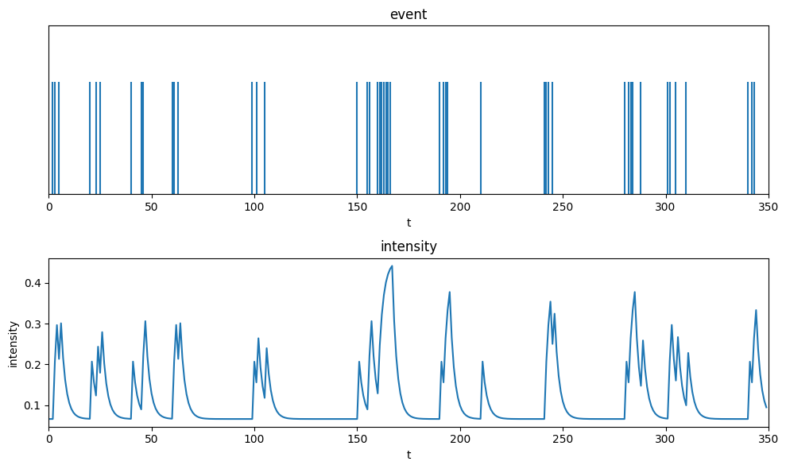
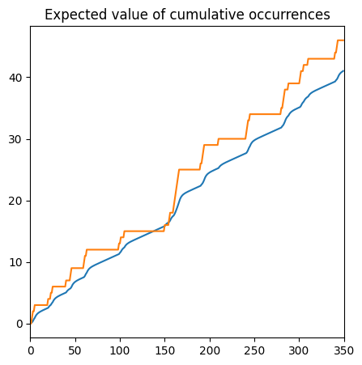

# hawkes-process

<div align="center">


</div>

## Hawkes Process
The probability density function of hawkes process for the observation period $[0, T]$ is given by

$$ p_{[0,T]}(\boldsymbol{t}_{n}) = \prod_{i=1}^{n} \left[\mu + \sum_{j < i}g(t-t_j)\right] \times \exp\left[-\mu T -  \sum_{i=1}^n\int_{t_i}^T g(s-t_i)ds \right] $$

where, $g(\tau)$ is a kernel function representing the influence from past events.

### Maximum \mathcal{L}ikelihood Estimation of a hawkes process
Assume the following for kernel functions
$$g(\tau) = ab \exp(-b\tau)$$

Maximum likelihood estimation of $\boldsymbol{\theta} = \{\mu, a, b\}$

The likelihood function $\mathcal{L}(\boldsymbol{\theta}|\boldsymbol{t}_n)$ is 

$$
\mathcal{L}(\boldsymbol{\theta}|\boldsymbol{t}_n) = p_{[0,T]}(\boldsymbol{t}_n | \boldsymbol{\theta})
$$

$$\hat{\boldsymbol{\theta}} = \argmin_{\boldsymbol{\theta}}-\log \mathcal{L}(\boldsymbol{\theta}|\boldsymbol{t}_n) $$

Estimate parameters by gradient descent method.

$$
\begin{aligned}
\frac{\partial}{\partial\mu}\log \mathcal{L}(\boldsymbol{\theta} | \boldsymbol{t}_n) &= \sum_{i=1}^n \frac{1}{\lambda_i} - T 
\\
\frac{\partial}{\partial a}\log \mathcal{L}(\boldsymbol{\theta} | \boldsymbol{t}_n) &= \sum_{i=1}^n \frac{1}{\lambda_i}\frac{\partial \lambda_i}{\partial a} - \sum_{i=1}^n [1 - \exp[-b(T-t_i)]]
\\
\frac{\partial}{\partial b}\log \mathcal{L}(\boldsymbol{\theta} | \boldsymbol{t}_n) &= \sum_{i=1}^n \frac{1}{\lambda_i}\frac{\partial \lambda_i}{\partial b} - \sum_{i=1}^n a(T-t_i) \exp[-b(T-t_i)]
\end{aligned}
$$
where, 
$$
\begin{aligned}
\lambda_i &= \mu + \sum_{j<i}ab\exp[-b(t_i-t_j)]
\\
\frac{\partial \lambda_i}{\partial a} &= \sum_{j<i}b\exp[-b(t_i - t_j)]
\\
\frac{\partial \lambda_i}{\partial b} &= \sum_{j<i} a\exp[-b(t_i - t_j)][1-b(t_i-t_j)]
\end{aligned}
$$

Simple computation is $O(n^2)$. However, efficient computation is $O(n)$.

$$G_i = \sum_{j < i} ab\exp[-b(t_i - t)]$$

Introducing the above, we have the following asymptotic equation.

$$
\begin{aligned}
G_{i+1} &= (G_{i} + ab)\exp[-b(t_{i+1} - t_i)] 
\\
\frac{\partial G_{i+1}}{\partial b} &= \left(\frac{\partial G_{i}}{\partial b} + a\right) \exp[-b(t_{i+1} - t_i)] - G_{i+1}(t_{i+1}-t_i)
\end{aligned}
$$

Using this, we can calculate $\lambda_i, \frac{\partial \lambda_i}{\partial a}, \frac{\partial \lambda_i}{\partial b}$

$$
\begin{aligned}
\lambda_i &= G_i + \mu \\
\frac{\partial \lambda_i}{\partial a} &=  \frac{G_i}{a}\\
\frac{\partial \lambda_i}{\partial b} &= \frac{\partial G_i}{\partial b}
\end{aligned}
$$
## Usage
Start container
```
$ docker-compose up -d --build
```
Attach container
```
$ docker exec -it hawkes-process /bin/bash
```
Maximum likelihood estimation
```
$ python steepest_decent.py
```

## Reference
[点過程の時系列解析](https://www.kyoritsu-pub.co.jp/book/b10003181.html)
